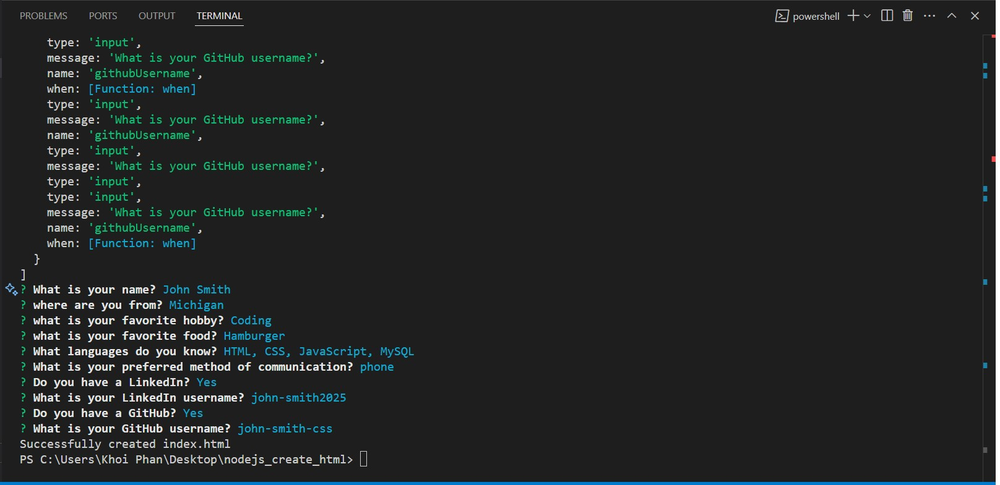
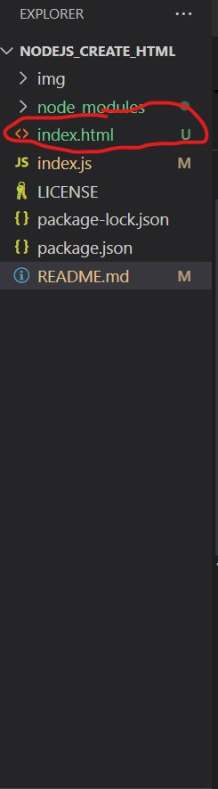
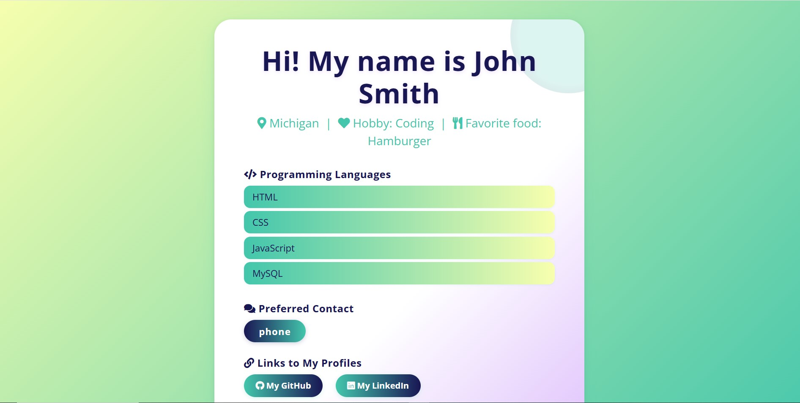

# Project: Portfolio Generator

In this activity, you will build a command-line tool that generates an HTML portfolio page from user input.

[](https://opensource.org/license/mit/)
## Purpose

This application is a command-line tool designed to help users quickly generate a personalized HTML portfolio page. By answering a series of prompts, users can create a professional-looking portfolio that displays their information and skills.

## Technologies Used

- Node.js
- Inquirer (for command-line prompts)
- JavaScript

## How to Use

1. Clone or download the repository to your local machine.
2. Open a terminal and navigate to the project directory.
3. Install the required dependencies by running:
  ```
  npm install
  ```
4. Start the application with:
  ```
  node index.js
  ```
5. Answer the questions presented in the terminal. The application will use your responses to generate an HTML file displaying your information.
6. Open the generated HTML file in your browser to view your portfolio.

## Screenshots

Below are some screenshots demonstrating the application's usage and the generated portfolio:

### Command-Line Prompts






after answered all questions, html will be generated automatically


### Generated Portfolio Example




## Questions?
  
### Github:[khoiphan-9194](https://github.com/khoiphan-9194)
  
### Reach Me Via Email: phanminhkhoi91@gmail.com

Thanks for viewing!


